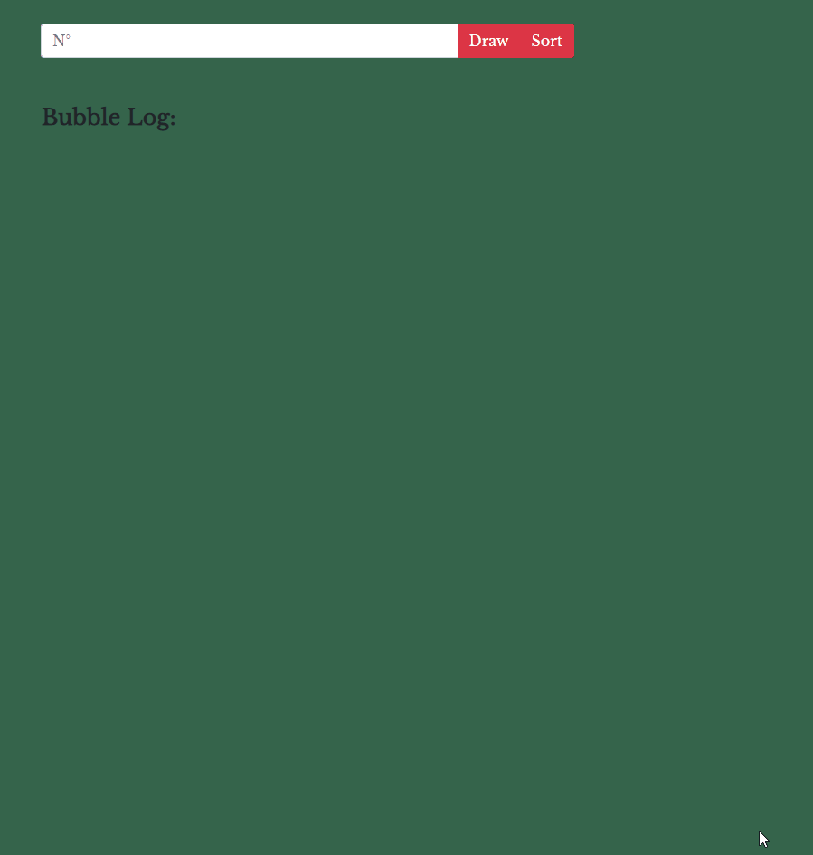

# Sorting Cards With Bubble Sorting

## Small Web App with custom CSS, Boostrap and Vanilla JavaScript

You can get a random amount of cards and after that sort them with buble sorting, you will see each iteration until final sort.

